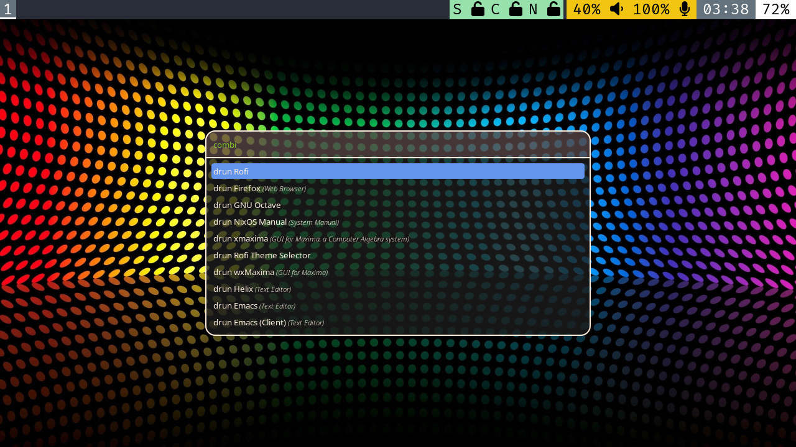

# uConsole Config



My customizations, on top of this base config:
https://github.com/robertjakub/oom-hardware

This is a work-in-progress, with some code needing to be manually
installed. I intend to keep working on it to make it fully
reproducible, but I am still learning my way around NixOS.

## What is provided in the config

- ly login manager / greeter
- sway compositor, and related utilities
  - waybar
  - rofi launcher
  - xkb configuration with swapped windows key and sticky modifiers
  - partial support for [quasi-sleep](https://forum.clockworkpi.com/t/sleep-support-development-for-cm4/14797/28)
- emacs and helix text editors
- firefox
- netsurf
- various random applications and games, subject to change
- openssh-server

## What is still Work In Progress

- The keyboard state indicators are meant to track the state of the
  sticky modifier keys, but it doesn't work. I may need to modify
  waybar, the keyboard firmware, or both.
- quasi-sleep is only partially implemented.
- you'd think netsurf would be ideal on this device, but it is not
  very keyboard-friendly.

## Installing this Config

In principle you can rebuild the SD-card from this config, but I
booted from: [this
image](https://drive.google.com/file/d/1uQDeoMy9Km9karEy3A7NIEe4YGN_yNGD/view?usp=sharing)
and then proceeded to edit and update the configuration manually.

First you need to configure your network using `wpa_supplicant`. I
won't explain how to do this here.

Copy or symlink the code in `uconsole/configs` to `/etc/nixos`, then
run `sudo nixos-rebuild switch`.

### Set a Background Image

The sway config expects a background image installed in
`./config/sway/background`. I don't include one here, so you need to
install one or you'll get errors when sway loads.

My preferred background:

```
curl https://wallpaperaccess.com/full/4154323.jpg -o ~/.config/sway/background
```

## Extra Code (to integrate later via home manager or some such)

- sway config
  - waybar config
  - foot
  - xkb (now with sticky modifiers)
- quasi-sleep support (still a work in progress)
  - `sleep/qsleep.sh`
  - `sleep/set_governor.c`


### `qsleep.sh`

This is inspired by the original found in [this
thread](https://forum.clockworkpi.com/t/sleep-support-development-for-cm4/14797/28),
but I found few issues with it, and so it's been heavily modified.

Unlike the original, it runs as a background process. This is because
I wanted to lock the screen with `swaylock`, which prevents the power
key from being received by `sway` to wake the machine back up. So this
script watches `/dev/input/event0` and responds to the power key
directly.

For this reason, the default power key behavior for `logind` is set to
`ignore` in the nixos config. Long-press is still set to `poweroff`,
as a fallback in case you get stuck.

I don't try to suspend / resume processes, as it seems like it caused
a lot of problems.

### `set_governor.c`

This is a minimal setuid root program which changes the cpu governor
state. I don't like setuid root binaries, but this was the easiest way
to experiment. I need to do some tests to see if changing the cpu
governor state actually makes much of a difference in terms of battery
life. With this kernel, the default governor is `schedutil`, which
takes the CPU scheduler into account.

If you manage to install `qsleep.sh` as a system service, you can
remove this hack. This is tricky, however, because `wlr-randr`, which
is used to turn the screen on and off, doesn't work when run as root.
